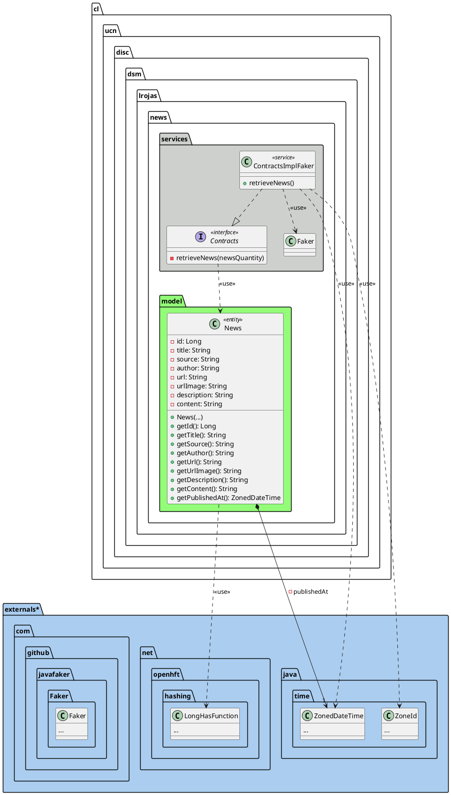

# The News Projects
Android Project to show a list of News

## Class Diagram

```puml
@startuml
package externals* #ABCDEF{
    package java.time{
    
        class ZonedDateTime{
            ...
        }
    
        class ZoneId{
            ...
        }
    }
    package net.openhft.hashing{
    
        class LongHasFunction{
            ...
        }
    }
    
    package com.github.javafaker.Faker{
    
        class Faker{
            ...
        }
    }

}

package cl.ucn.disc.dsm.lrojas.news{
    
    package model #93FC79{
        class News <<entity>>{
            - id: Long
            - title: String
            - source: String
            - author: String
            - url: String
            - urlImage: String
            - description: String
            - content: String
            + News(...)
            + getId(): Long
            + getTitle(): String
            + getSource(): String
            + getAuthor(): String
            + getUrl(): String
            + getUrlImage(): String
            + getDescription(): String
            + getContent(): String
            + getPublishedAt(): ZonedDateTime     
        }
        News *--> "1" ZonedDateTime : - publishedAt
        News ..> LongHasFunction : <<use>>
    }
    package services #cccfccfc{
        interface Contracts <<interface>>{
            - retrieveNews(newsQuantity)
        }
        Contracts ..> News : <<use>>
        
        class ContractsImplFaker <<service>>{
            + retrieveNews()
        }
        ContractsImplFaker ..|> Contracts
        ContractsImplFaker ..> ZonedDateTime : <<use>>
        ContractsImplFaker ..> ZoneId : <<use>>
        ContractsImplFaker ..> Faker : <<use>>
        
        
    }
}


@enduml

```
## Licence
[MIT](https://choosealicense.com/licenses/mit)